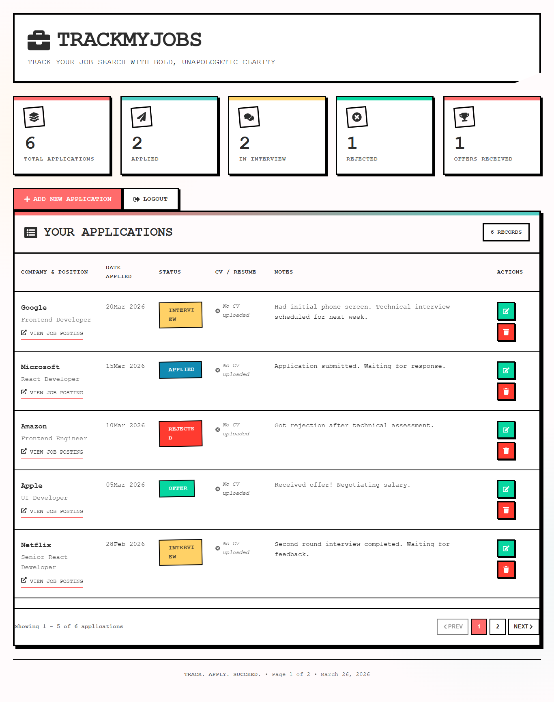

# TrackMyJobs - Job Application Tracker

A modern, full-stack job application tracking system that helps you manage and monitor your job search journey. Track applications, upload CVs, and visualize your progress with a sleek neo-brutalist interface.



---

## Features

- **Secure Authentication** - JWT-based authentication with email/password
- **CV Management** - Upload, download, and manage CV/resume files with original filenames
- **Dashboard Statistics** - Visual overview of application status (Applied, Interview, Rejected, Offer)
- **Full CRUD Operations** - Create, read, update, and delete job applications
- **Responsive Design** - Neo-brutalist UI that works seamlessly on desktop and mobile
- **Pagination** - Efficient navigation through your application list
- **File Storage** - Secure file uploads with original filename preservation
- **Modern Tech Stack** - React 18 frontend with Node.js/Express backend
- **Demo Mode** - One-click demo login to explore the app

---

## Tech Stack

**Frontend**
- **React 18** - UI library with hooks and functional components
- **React Router v6** - Client-side routing with future flags
- **TanStack Query** - Server state management and caching
- **Axios** - HTTP client for API requests
- **React Hot Toast** - Beautiful toast notifications
- **React Icons** - Icon library for UI elements
- **Custom CSS** - Neo-brutalist design with responsive layouts

**Backend**
- **Node.js** - JavaScript runtime
- **Express.js** - Web framework for REST API
- **MySQL** - Relational database
- **JWT** - JSON Web Tokens for authentication
- **Multer** - File upload handling
- **bcryptjs** - Password hashing
- **Express Validator** - Input validation
- **Rate Limiting** - Protection against brute force attacks

---

## Project Structure

```
TrackMyJobs
├─ .prettierrc
├─ client
│  ├─ package-lock.json
│  ├─ package.json
│  ├─ public
│  │  ├─ favicon.ico
│  │  ├─ index.html
│  │  ├─ logo192.png
│  │  ├─ logo512.png
│  │  ├─ manifest.json
│  │  └─ robots.txt
│  ├─ README.md
│  └─ src
│     ├─ App.css
│     ├─ App.js
│     ├─ App.test.js
│     ├─ components
│     │  ├─ DateBadge.js
│     │  ├─ LoadingSpinner.js
│     │  ├─ Pagination.js
│     │  ├─ PrivateRoute.js
│     │  └─ StatusBadge.js
│     ├─ hooks
│     │  └─ useAuth.js
│     ├─ index.css
│     ├─ index.js
│     ├─ logo.svg
│     ├─ pages
│     │  ├─ AddApplication.js
│     │  ├─ Dashboard.js
│     │  ├─ EditApplication.js
│     │  ├─ Login.js
│     │  └─ Register.js
│     ├─ reportWebVitals.js
│     ├─ services
│     │  ├─ api.js
│     │  ├─ applicationService.js
│     │  └─ authService.js
│     ├─ setupTests.js
│     └─ styles
│        └─ index.css
├─ database
│  ├─ sample-data.sql
│  └─ schema.sql
├─ package-lock.json
├─ package.json
└─ server
   ├─ config
   │  ├─ database.js
   │  └─ multer.js
   ├─ controllers
   │  ├─ applicationController.js
   │  └─ authController.js
   ├─ create-admin.js
   ├─ middleware
   │  ├─ auth.js
   │  └─ rateLimiter.js
   ├─ models
   │  ├─ Application.js
   │  └─ User.js
   ├─ package-lock.json
   ├─ package.json
   ├─ routes
   │  ├─ applicationRoutes.js
   │  └─ authRoutes.js
   ├─ server.js
   └─ setup-db.js

```

---

## Getting Started

**Prerequisites**

- **Node.js** (v14 or higher)
- **MySQL** (v5.7 or higher)
- **npm** or **yarn**

---

## Installation 

**1. Clone the repository**
```bash
git clone https://github.com/yourusername/TrackMyJobs.git
cd TrackMyJobs
```

**2. Install Backend Dependencies**
```bash
cd server
npm install
```

**3. Install Frontend Dependencies**
```bash
cd client
npm install
```

**4. Set Up Database**

**Option A: Using MySQL command line
```bash
# Login to MySQL
mysql -u root -p

# Create database
CREATE DATABASE trackmyjobs;
USE trackmyjobs;

# Import schema
source database/schema.sql;
```

**Option B: Using the setup script**
```bash
cd server
node setup-db.js
```

**5. Configure Environment Variables**
Create a ```.env``` file in the ```server``` directory:
```bash
# Server Configuration
PORT=5000
NODE_ENV=development
CLIENT_URL=http://localhost:3000

# Database Configuration
DB_HOST=localhost
DB_USER=root
DB_PASSWORD=your_mysql_password
DB_NAME=trackmyjobs

# Security
JWT_SECRET=your_super_secret_jwt_key_change_this_in_production
```

**6. Create Demo User**
```bash
cd server
node create-demo.js
```

Follow the prompts to create an demo user with:
- Email: demo@example.com
- Display Name: Demo User
- Password: (choose a strong password)

**7. (Optional) Load Sample Data**
```bash
mysql -u root -p trackmyjobs < database/sample-data.sql
```

**8. Start the Application**

**Backend Server:**
```bash
cd server
npm run dev
# Server runs on http://localhost:5000
```

**Frontend Development Server:**
```bash
cd client
npm start
# App runs on http://localhost:3000
```

---

## Default Login (After Setup)

- **Email:** demo@trackmyjobs.com
- **Password:** changeme123

Or use the **Demo Login** button on the login page!

---

## API Endpoints

**Authentication**
| Method    | Endpoint      |    Description   |
|  ---  |  ---  |  ---  |
| POST      | ```/api/auth/login```      |   User login    |
| POST     |  ```/api/auth/Register```     |   User registration    |
| GET     | ```api/auth/verify```      |    Verify JWT token   |

**Applications**
|  Method     |  Endpoint     |  Description     |
|  ---  |  ---  |  ---  |
| GET      | ```/api/applications```      |    Get all applications (paginated)   |
| GET      |  ```/api/applications/:id```     |   Get single application    |
| POST      |  ```/api/applications```     |  Create new application     |
| PUT      | ```/api/applications/:id```      |  Update application     |
| DELETE      |  ```/api/applications/:id```     |  Delete application     |
| GET      | ```/api/applications/:id/download```      | Download CV file     | 

---

## Features in Detail

**Authentication**
- Email-based login with password hashing
- JWT token storage in localStorage
- Session persistence
- Protected routes for authenticated users

**Application Management**
- Add new job applications with company, title, date, and status
- Upload CV files (PDF, DOC, DOCX, max 5MB)
- Edit application details
- Delete applications with CV cleanup
- Download CVs with original filenames

**Dashboard**
- Statistics cards showing application counts by status
- Paginated list of applications
- Quick actions (edit, delete, download CV)
- Responsive table layout for mobile devices

**File Management**
- Secure file upload with unique filenames
- Original filename preservation
- Automatic file cleanup on deletion
- MIME type validation
- Size limit enforcement

**Security Features**
- Password hashing with bcrypt
- JWT token authentication
- Input validation with express-validator
- Rate limiting on login attempts
- SQL injection prevention with parameterized queries
- XSS protection with helmet
- CORS configuration
- Secure session management

**UI/UX Features**
- **Neo-brutalist Design** - Bold borders, strong shadows, vibrant colors
- **Responsive Layout** - Works on desktop, tablet, and mobile
- **Loading States** - Spinners and loading indicators
- **Toast Notifications** - Success and error messages
- **Form Validation** - Real-time validation with user feedback
- **Password Strength Meter** - Visual password strength indicator
- **File Preview** - Show selected file details before upload
- **Animations** - Smooth transitions and hover effects

---

## Development Scripts

**Backend**
```bash
npm run dev     # Start development server with nodemon
npm start       # Start production server
```

**Frontend**
```bash
npm start       # Start development server
npm run build   # Build for production
npm test        # Run tests
```

---

## Database Schema

**Users Table**
```sql
- id (INT, PRIMARY KEY)
- email (VARCHAR 255, UNIQUE)
- password_hash (VARCHAR 255)
- display_name (VARCHAR 100)
- created_at (TIMESTAMP)
```

**Applications Table**
```sql
- id (INT, PRIMARY KEY)
- user_id (INT, FOREIGN KEY)
- company_name (VARCHAR 255)
- job_title (VARCHAR 255)
- job_link (VARCHAR 500)
- application_date (DATE)
- status (ENUM: Applied, Interview, Rejected, Offer)
- notes (TEXT)
- cv_filename (VARCHAR 255)
- cv_original_name (VARCHAR 255)
- cv_mime_type (VARCHAR 100)
- cv_size (INT)
- created_at (TIMESTAMP)
- updated_at (TIMESTAMP)
```

---

## Troubleshooting

**Common Issues and Solutions

**MySQL Connection Error:**
```bash
# Check if MySQL is running
sudo service mysql status  # Linux
brew services list         # Mac
# Windows: Check Services panel

# Verify credentials in .env file
```

**Port 5000 Already in Use:**
```bash
# Find process using port 5000
lsof -i :5000  # Mac/Linux
netstat -ano | findstr :5000  # Windows

# Kill the process or change PORT in .env
```

**File Upload Fails:**
- Check if ```server/uploads/cvs``` directory exists
- Verify write permissions on uploads folder
- Ensure file size is under 5MB

**Build Errors:**
```bash
# Clear cache and reinstall
cd client
rm -rf node_modules package-lock.json
npm install
```

---

## Contributing

1. Fork the repository
2. Create your feature branch ```(git checkout -b feature/AmazingFeature)```
3. Commit your changes ```(git commit -m 'Add some AmazingFeature')```
4. Push to the branch ```(git push origin feature/AmazingFeature)```
5. Open a Pull Request

